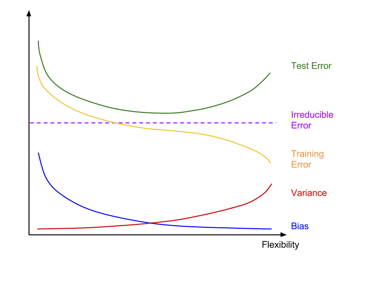

Chapter 2 Exercises
================

-   [Conceptual Exercises](#conceptual-exercises)
    -   [Question 1 (in progress)](#question-1-in-progress)
    -   [Question 2](#question-2)
    -   [Question 3](#question-3)
    -   [Question 4](#question-4)
    -   [Question 5 (in progress)](#question-5-in-progress)
    -   [Question 6](#question-6)
    -   [Question 7](#question-7)

Conceptual Exercises
--------------------

### Question 1 (in progress)

**For each of parts (a) through (d), indicate whether we would generally expect the performance of a flexible statistical learning method to be better or worse than an inflexible method. Justify your answer.**

1.  *The sample size n is extremely large, and the number of predictors p is small.*
2.  *The number of predictors p is extremely large, and the number of observations n is small.*
3.  \*The relationship between the predictors and response is highly non-linear.\*\*
4.  *The variance of the error terms, i.e. σ2 = Var(𝜖), is extremely high.*

**1a.** The **inflexible** method should perform better. The large sample size will create a large amount of variance (when different data sets are tested), while the small number of predictors will create a small amount of bias. This will increase the test MSE for flexible methods to a greater extent than for inflexible methods.

Alternative:

    The flexible approach would perform better as it would fit the data closer.  
    For a large sample size, the flexible approach will obtain a better fit than the inflexible approach.

**1b.** The **flexible** method should perform better. With a large number of predictors, an inflexible method will introduce a large amount of bias while trying to approximate the situation. The small sample size will create a small amount of variance. The test MSE for inflexible methods will increase by a greater amount.

Alternative:

    The inflexible approach would perform better as the flexible method would 
    overfit the small number of observations.

    The inflexible method should perform better; the small sample makes it more 
    difficult for the flexible method to obtain a good fit. 
    The large number of predictors may also affect the accuracy of the flexible 
    method if noise (non-relevant) predictors affect the separation of observations 
    that would be related under the relevant predictors (curse of dimensionality).

**1c.** The **flexible** method should perform better. The inflexible method will introduce a large amount of bias while trying to approximate this non-linear relationship, and thus produce a higher test MSE.

**1d.** It is **not possible to determine** which method will perform better as the variance of the error terms is not influenced by the choice of statistical learning method, given that it is derived from irreducible error.

------------------------------------------------------------------------

### Question 2

**Explain whether each scenario is a classification or regression problem, and indicate whether we are most interested in inference or prediction. Finally, provide n and p.**

1.  *We collect a set of data on the top 500 firms in the US. For each firm we record profit, number of employees, industry and the CEO salary. We are interested in understanding which factors affect CEO salary.*
2.  *We are considering launching a new product and wish to know whether it will be a success or a failure. We collect data on 20 similar products that were previously launched. For each product we have recorded whether it was a success or failure, price charged for the product, marketing budget, competition price, and ten other variables.*
3.  *We are interesting in predicting the % change in the US dollar in relation to the weekly changes in the world stock markets. Hence we collect weekly data for all of 2012. For each week we record the % change in the dollar, the % change in the US market, the % change in the British market, and the % change in the German market.*

**2a.** This scenario is a **regression** problem as the response variable (CEO salary) is quantitative. We are most interested in **inference**, in terms of how different predictors affect the CEO salary.
**n = 500** (number of firms)
**p = 3** (record profit, number of employees, industry)

**2b.** This scenario is a **classification** problem as the response variable is qualitative (success or failure). We are most interested in **prediction**, since we want to know if the new product launch will succeed.
**n = 20** (number of previously launched products)
**p = 13** (price charged, marketing budget, competition price, 10 other variables)

**2c.** This scenario is a **regression** problem as the response variable (% change in US dollar) is quantitative. We are most interested in **prediction**, as we want to know the % change in the dollar each week.
**n = 52** (52 weeks in a year)
**p = 3** (% change in the US market, % change in the British market, % change in the German market)

------------------------------------------------------------------------

### Question 3

**We now revisit the bias-variance decomposition.**

1.  *Provide a sketch of typical (squared) bias, variance, training error, test error, and Bayes (or irreducible) error curves, on a single plot, as we go from less flexible statistical learning methods towards more flexible approaches. The x-axis should represent the amount of flexibility in the method, and the y-axis should represent the values for each curve. There should be five curves. Make sure to label each one.*
2.  *Explain why each of the five curves has the shape displayed in part (a).*

As the flexibility of the statistical learning method increases:

-   **(Squared) bias decreases** because the statistical learning method is better able to fit what is most likely a complicated relationship between the predictors and response.
-   **Variance increases** because the model used fits the training data very closely, so changes to the data points or the data set will cause large changes in the predicted responses.
-   **Training error decreases** because the model will always become a better fit for the training data, even accounting for irreducible error within the data itself.
-   **Test error decreases at first, then increases** because initially, a more flexible method quickly reduces the bias resulting from the test data; but a method that is too flexible has very high variance that outweighs the loss in bias. The method is said to be overfitting the training data, such that it captures trivial patterns within the training data which may not be present in the test data.
-   **Bayes(irreducible) error** does not change as it is independent of the statistical learning method used.

------------------------------------------------------------------------

### Question 4

**You will now think of some real-life applications for statistical learning.**

1.  *Describe three real-life applications in which classification might be useful. Describe the response, as well as the predictors. Is the goal of each application inference or prediction? Explain your answer.*
2.  *Describe three real-life applications in which regression might be useful. Describe the response, as well as he predictors. Is the goal of each application inference or prediction? Explain your answer.*
3.  *Describe three real-life applications in which cluster analysis might be useful.*

**Classification** may be useful for:

-   Identifying which emails are potentially harmful (marked as spam or phishing attempts).
    -   Response: Harmful / Not harmful
    -   Predictors:
        -   Word frequency
        -   Frequency of spelling errors
        -   Frequency of formatting errors
    -   Goal: Prediction, as the main objective is to mark out potentially harmful email and automatically filter them to reduce the likelihood of the user falling victim to such emails
-   Identifying risk factors for obesity
    -   Response: Levels of obesity
    -   Predictors:
        -   Calorie intake
        -   Sugar intake
        -   Amount of exercise
        -   Metabolism rate
        -   Genetic expression
    -   Goal: Inference, as the main objective is to understand what behaviours/factors increase obesity risk, so healthcare professionals can make suitable recommendations to patients or policymakers

**Regression** may be useful for:

-   Understanding and breaking down changes in the Consumer Price Index:
    -   Response: CPI, price changes in individual categories
    -   Possible Predictors:
        -   Weights for item categories
        -   Exchange rates
        -   Inflation in currency
        -   Import/export volume
        -   Seasonal and current events (demand/supply changes)
    -   Goal: Inference, as economists seek to understand how different predictors influence the CPI, in order to formulate future policies
-   Predicting fuel economy of vehicles
    -   Response: fuel economy in miles per gallon or litres per 100km
    -   Predictors include:
        -   Vehicle speed
        -   Driver behaviour
        -   Type of fuel
        -   Weather
        -   Tyre pressure
    -   Goal: prediction, when consumers want to purchase a vehicle with the best fuel economy
    -   Goal: inference, when transportation companies want to know how to optimize fuel economy for their fleet of vehicles

**Clustering** may be useful for:

-   Identifying sections of roads which are prone to accidents or have a high occurrence of speeding drivers
    -   Identify which roads need repairs, installation of safety features, and installation of devices that discourage speeding (speed bumps, cameras)
-   Group together frequent users/customers based on residential location
    -   Open new outlets to better serve frequent customers, or to reach out to customers who live far away from existing outlets

------------------------------------------------------------------------

### Question 5 (in progress)

**What are the advantages and disadvantages of a very flexible (versus a less flexible) approach for regression or classification?**
**Under what circumstances might a more flexible approach be preferred to a less flexible approach? When might a less flexible approach be preferred?**

A flexible approach is able to better estimate the systematic relationship between the predictors and the response, especially when this relationship is unknown and cannot be assumed to take a simple form (like a linear relationship, which could then be easily approximated by inflexible methods).

However, flexible approaches run the risk of overfitting the training data given, which results in a model that cannot accurately predict the responses on new observations / datasets.

A more flexible approach is preferred if there are many predictors involved, as a less flexible approach tends to introduce high levels of bias and reduces the accuracy of predicted responses.

A less flexible approach is preferred if ...

------------------------------------------------------------------------

### Question 6

**Describe the differences between a parametric and a non-parametric statistical learning approach. What are the advantages of a parametric approach to regression or classification (as opposed to a non-parametric approach)? What are its disadvantages?**

A parametric statistical learning approach makes some assumptions about the functional form of the relationship function f, so that the problem of estimating f is reduced to estimating a smaller set of parameters 𝛽0 , 𝛽1 ,𝛽2 ... 𝛽n. A non-parametric statistical learning approach does not make assumptions about f, and instead tries to find an estimate of f that fits the data points as close as possible.

The advantages of a parametric approach are that it is easier to solve, and does not need a very large number of observations to estimate f. The disadvantages are that the assumed form of f may be very different from its true form, such that the estimates produced by the model will be very poor. Another issue is that adopting more flexible parametric approaches to estimate f have the risk of overfitting the data given, which also leads to poor estimates on new observations.

While a non-parametric approach avoids the problem of missing out on the true form of f, it requires a far greater number of data points in order to estimate an accurate form of f.

------------------------------------------------------------------------

### Question 7

**The table below provides a training data set containing six observations, three predictors, and one qualitative response variable.**

| Obs. | X1  | X2  | X3  | Y     |
|------|-----|-----|-----|-------|
| 1    | 0   | 3   | 0   | Red   |
| 2    | 2   | 0   | 0   | Red   |
| 3    | 0   | 1   | 3   | Red   |
| 4    | 0   | 1   | 2   | Green |
| 5    | −1  | 0   | 1   | Green |
| 6    | 1   | 1   | 1   | Red   |

Suppose we wish to use this data set to make a prediction for Y when X1 = X2 = X3 = 0 using K-nearest neighbors.

1.  Compute the Euclidean distance between each observation and the test point, X1 = X2 = X3 = 0.
2.  What is our prediction with K = 1? Why?
3.  What is our prediction with K = 3? Why?
4.  If the Bayes decision boundary in this problem is highly non-linear, then would we expect the best value for K to be large or small? Why?

**7a:**

<table style="width:100%;">
<colgroup>
<col width="7%" />
<col width="21%" />
<col width="21%" />
<col width="21%" />
<col width="27%" />
</colgroup>
<thead>
<tr class="header">
<th>Obs.</th>
<th>Distance from X1</th>
<th>Distance from X2</th>
<th>Distance from X3</th>
<th>Euclidean Distance to</th>
</tr>
</thead>
<tbody>
<tr class="odd">
<td>1</td>
<td>0</td>
<td>-3</td>
<td>0</td>
<td>3.000</td>
</tr>
<tr class="even">
<td>2</td>
<td>-2</td>
<td>0</td>
<td>0</td>
<td>2.000</td>
</tr>
<tr class="odd">
<td>3</td>
<td>0</td>
<td>-1</td>
<td>-3</td>
<td>3.162</td>
</tr>
<tr class="even">
<td>4</td>
<td>0</td>
<td>-1</td>
<td>-2</td>
<td>2.236</td>
</tr>
<tr class="odd">
<td>5</td>
<td>1</td>
<td>0</td>
<td>-1</td>
<td>1.414</td>
</tr>
<tr class="even">
<td>6</td>
<td>-1</td>
<td>-1</td>
<td>-1</td>
<td>1.732</td>
</tr>
</tbody>
</table>

**7b:** With K = 1, the prediction is Green, since observation 5 is the nearest neighbour to the test point based on lowest Euclidean distance.

**7c:** With K = 3, the prediction is Red, since the conditional probability is ⅔ for Red and ⅓ for Green, as 2 out of the 3 nearest neighbours are measured as Red for Y.

**7d:** The best value for K would be small. The most accurate KNN decision boundary needs to be highly flexible in order to best estimate the non-linear Bayes decision boundary. A small value for K allows the classifier to produce a adequately flexible decision boundary.
