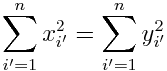

```{r setup, include=FALSE}
knitr::opts_chunk$set(echo = TRUE, warning = FALSE)
library(MASS)
library(ISLR)
library(dplyr)
source("interaction.R")
```

## Question 8

*This question involves the use of simple linear regression on the `Auto` data set.*

We start off by loading the data and taking a look at its structure:
```{r Auto str}
data("Auto")
names(Auto)
str(Auto)
```

### Part 8a
*Use the `lm()` function to perform a simple linear regression with mpg as the response and horsepower as the predictor. Use the `summary()` function to print the results. Comment on the output.*

```{r lm summary}
mpg_hp_lm <- lm(mpg ~ horsepower, data = Auto)
summary(mpg_hp_lm)
```


*For example:*  

i. *Is there a relationship between the predictor and the response?*  
ii. *How strong is the relationship between the predictor and the response?*  
iii. *Is the relationship between the predictor and the response positive or negative?*  
iv. *What is the predicted mpg associated with a horsepower of 98? What are the associated 95% confidence and prediction intervals?*  

The relation between the predictor `horsepower` and response `mpg` is negative, as shown by the estimated coefficient **`r coef(mpg_hp_lm)[2]`** which is less than 0. 

Based on the output generated by the linear model, the p-value associated with the coefficient for `horsepower` is extremely low. We can conclude that there is a **significant negative** relationship between `horsepower` and `mpg`.

The strength of the relationship between `horsepower` and `mpg` is indicated by the *Pearson correlation coefficient*. For a simple linear regression model, the correlation coefficient can be found by taking the *negative* square root (since the linear coefficient is negative) of the Multiple R-squared value in the output:
```{r}
-sqrt(summary(mpg_hp_lm)$r.squared)
```

Alternatively, the correlation coefficient can be found using the `cor()` function:  
```{r}
cor(Auto$mpg, Auto$horsepower)
```

The magnitude of the correlation coefficient suggests a **moderately strong relationship** between `horsepower` and `mpg`.

We can find out the predicted values of `mpg` and their intervals using the `predict()` function.  
The following code attempts to predict `mpg` and the 95% confidence intervals for a given set of `horsepower` values:
```{r}
predict(mpg_hp_lm, newdata = data.frame(horsepower = 98), 
        interval = "confidence")
```

We change the `interval` parameter if we want to calculate the 95% *prediction* intervals:
```{r}
predict(mpg_hp_lm, newdata = data.frame(horsepower = 98), 
        interval = "prediction")
```

Based on the output, for `horsepower` of 98, the predicted `mpg` value would be about **24.47** (miles per gallon); the 95% confidence interval would be approximately **(23.97, 24.96)** and the 95% prediction interval would be approximately **(14.81, 34.12)**.  
(The confidence interval reflects the uncertainty surrounding the predicted `mpg` averaged over multiple vehicles; the prediction interval reflects the uncertainty surrounding the `mpg` predicted for a particular vehicle, which also takes into the account the irreducible error &#1013;.)

### Part 8b
*Plot the response and the predictor. Use the `abline()` function to display the least squares regression line.*

```{r q8 plot}
plot(mpg ~ horsepower, data = Auto, pch = 1, cex = 0.6,
     main = "Miles per gallon against Horsepower",
     xlab = "Engine Horsepower", ylab = "Miles per Gallon")
abline(mpg_hp_lm)
```

### Part 8c
*Use the `plot()` function to produce diagnostic plots of the least squares regression fit. Comment on any problems you see with the fit.*
```{r q8 diagnostic plot, fig.width=12, fig.height=9}
par(mfrow = c(2,2))
plot(mpg_hp_lm)
```

A brief description of the diagnostic plots shown above:  

* The top-left plot is a residual plot, which plots the residuals *e~i~ = y~i~ - &#375;~i~* against the fitted values.  
* The top-right plot is a quantile-quantile plot (QQ plot) of the residuals to check if the residuals are normally distributed.  
* The bottom-left plot is a scale-location plot that examines if residuals are spread equally along the range of predictors and can be used to check the assumption of equal variance (homoscedascity).  
* The bottom-right plot is a plot of residuals against leverage, to check for outliers with significant leverage that would heavily influence the regression model.

From the diagnostic plots, we can see the following issues:

* The plot of residuals against fitted values appear to exhibit a pattern which suggests that our linear model is not a good fit for the relationship between `horsepower` and `mpg`: the pattern in the residuals may be due to a non-linear relationship that the model does not capture.  
* The response-predictor plot generated in (b) suggests that the relationship between `mpg` and `horsepower` may not be linear; the rate of change in `mpg` decreases as `horsepower` increases, so a reciprocal function might produce a better fit.

## Question 9

This question involves the use of multiple linear regression on the `Auto` data set.

### Part 9a

*Produce a scatterplot matrix which includes all of the variables in the data set.*

```{r q9 scatterplot, fig.width=12, fig.height=9}
plot(Auto)
```

### Part 9b

*Compute the matrix of correlations between the variables using the function `cor()`. You will need to exclude the `name` variable, which is qualitative.*

```{r correlation matrix}
auto_noname <- Auto[, -9] # new data frame that excludes name variable (9th column)
signif(cor(auto_noname), 4)
```

### Part 9c
*Use the `lm()` function to perform a multiple linear regression with mpg as the response and all other variables except name as the predictors. Use the `summary()` function to print the results.*  

```{r multiple lm summary}
auto_multiple_lm <- lm(mpg ~ ., data = auto_noname)
(auto_mlm_summary <- summary(auto_multiple_lm)) # assigns and prints the summary
```

Comment on the output. For instance:

i. Is there a relationship between the predictors and the response?  
ii. Which predictors appear to have a statistically significant relationship to the response?  
iii. What does the coefficient for the year variable suggest?  

The F-statistic for the overall model is very high, suggesting that there is a relationship between the predictors and the response (rejecting the null hypothesis that all of the predictors are not related to the response)

Based on the p-values for the t-statistic, we think the following predictors may have a statistically significant relationship with the response:  

* `displacement`
* `weight`
* `year`
* `origin`

The coefficient for `year` is `r round(auto_mlm_summary$coefficients["year","Estimate"], 3)`, which implies that the average miles per gallon increases by this amount every year when all other predictors are held constant.

### Part 9d
*Use the `plot()` function to produce diagnostic plots of the linear regression fit. Comment on any problems you see with the fit. Do the residual plots suggest any unusually large outliers? Does the leverage plot identify any observations with unusually high leverage?*

```{r q9 diagnostic plot, fig.width=12, fig.height=9}
par(mfrow = c(2,2))
plot(auto_multiple_lm)
```

* The residuals-fitted plot shows a slight pattern which suggests the presence of relationships not accounted for by our model (such as non-linear predictors).  
* There are some observations with particularly large residuals (especially index 327 which is marked on all four plots).  
* Index 14 is a high-leverage observation but the residual is not considered significant enough to severely influence the regression model.

### Part 9e (in progress)
*Use the `\*` and `:` symbols to fit linear regression models with interaction effects. Do any interactions appear to be statistically significant?*

For example, we may want to find out if there may be a significant interaction between `displacement` and `horsepower` (in other words, does the relationship between `displacement` and `mpg` change depending on the `horsepower` of the vehicle?) We use the `update()` and `summary()` functions to refit the model:

```{r}
summary(
    update(auto_multiple_lm, ~ . + displacement:weight)
    )
```

The interaction term `displacement:weight` appears to be significant based on its p-value; in addition the R-squared value has also risen by about .04, which suggests that our new model might be a slightly better fit than the model used in Part 9c.

It's also worth noting that `horsepower` itself is also now a significant predictor.

Fitting various interaction effects into the model yields the following p-values, as well as their respective model fit:

```{r echo = FALSE}
possible_preds <- c("displacement", "horsepower", "weight", "year", "origin")
build_values_matrix(possible_preds, auto_multiple_lm)
```


<!-- test combinations of one interaction term, then spread the table -->

### Part 9f (in progress)
*Try a few different transformations of the variables, such as log(X), √X, X^2^ . Comment on your findings.*

We can refit the model with a quadratic transformation term `horsepower^2^` to observe the fit of the new model:

```{r}
summary(
    update(auto_multiple_lm, ~ . + I(horsepower^2))
    )
```

The transformed predictor appears to be significant as well, with the R-squared value increasing by about 0.3.

## Question 10
*This question should be answered using the `Carseats` data set.*

We load the `Carseats` data set and examine the structure:

```{r carseats intro}
data("Carseats")
str(Carseats)
```

We can see that our variables of interest can be classified as quantitative and categorical:  

* `Sales` - Unit sales (in thousands) at each location, quantitative response  
* `Price` - Price company charges for car seats at each site, quantitative predictor  
* `Urban` - A factor with levels No and Yes to indicate whether the store is in an urban or rural location (Yes = 2, No = 1), qualitative predictor  
* `US` - A factor with levels No and Yes to indicate whether the store is in the US or not (Yes = 2, No = 1), qualitative predictor


### Part 10a 
*Fit a multiple regression model to predict `Sales` using `Price`, `Urban`, and `US`.*

```{r carseats lm}
carseats_multiple_lm <- lm(Sales ~ Price + Urban + US, data = Carseats)
summary(carseats_multiple_lm)
```

The contrasts for the qualitative predictors `Urban` and `US` are as shown below:

```{r carseats contrasts}
contrasts(Carseats$Urban)
contrasts(Carseats$US)
```

### Part 10b
*Provide an interpretation of each coefficient in the model. Be careful—some of the variables in the model are qualitative!*

```{r include=FALSE}
carseats_mlm_coef <- 
    summary(carseats_multiple_lm)$coefficients %>% 
    signif(4)
```

* The coefficient for `Price` is `r carseats_mlm_coef[2,1]`. This means that for every dollar the company charges for the car seats, the average unit sales **decreases** by about **54.46 units**.  
* The coefficient for `UrbanYes` is `r carseats_mlm_coef[3,1]`. This means that on average, stores in urban locations sell **21.92 less units** than stores in rural locations.
* The coefficient for `US` is `r carseats_mlm_coef[4,1]`. This means that on average, stores in the United States sell **1201 more units** than stores outside of the United States.

### Part 10c
*Write out the model in equation form, being careful to handle the qualitative variables properly.*


<!-- $$ y_i = 13.043 - (0.054 \times x_{i1}) - (0.022 \times x_{i2}) + (1.201 \times x_{i3}) + \epsilon $$ -->


<!-- $$ \text{where } x_{i2} =\begin{cases}1 & \text{if }i\text{th store is in an urban location}\\0 & \text{if }i\text{th store is in a rural location}\end{cases} $$ -->


<!-- $$ \text{where } x_{i3} =\begin{cases}1 & \text{if }i\text{th store is in the US}\\0 & \text{if }i\text{th store is not in the US}\end{cases} $$ -->

### Part 10d
*For which of the predictors can you reject the null hypothesis H~0~: β~j~ = 0?*

We can reject the null hypothesis for the predictors `Price` and `US`, based on the p-values for these two predictors being very low. In other words, we infer that there is a significant relationship between `Price` and `Sales`, as well as `US` and `Sales`.

### Part 10e
*On the basis of your response to the previous question, fit a smaller model that only uses the predictors for which there is evidence of association with the outcome.*

```{r}
carseats_smaller_lm <- lm(Sales ~ Price + US, data = Carseats)
summary(carseats_smaller_lm)
```


### Part 10f 
*How well do the models in (a) and (e) fit the data?*

```{r model fit, echo=FALSE}
model_name <- c("Model with Price, Urban and US", 
                "Model with Price and US")
RSE <- c(signif(summary(carseats_multiple_lm)$sigma, 4),
         signif(summary(carseats_smaller_lm)$sigma, 4))
R2 <- c(signif(summary(carseats_multiple_lm)$r.squared, 4),
           signif(summary(carseats_smaller_lm)$r.squared, 4))
Adj.R2 <- c(signif(summary(carseats_multiple_lm)$adj.r.squared, 4),
            signif(summary(carseats_smaller_lm)$adj.r.squared, 4))
as.data.frame(list(Model = model_name, 
                   RSE = RSE, 
                   Rsquared = R2))
```

Both models exhibit similar levels of RSE (residual squared error), and explain about 24% of the variance in `sales`. 

### Part 10g
*Using the model from (e), obtain 95% confidence intervals for the coefficient(s).*

```{r}
confint(carseats_smaller_lm)
```


### Part 10h 
*Is there evidence of outliers or high leverage observations in the model from (e)?*

```{r q10 diagnostic plots, fig.width=12, fig.height=9}
par(mfrow = c(2,2))
plot(carseats_smaller_lm, id.n = 5)
```

From the residuals-fitted values plot, we see that there are some outliers (indices 51 and 377 show the greatest residuals), however most of these outliers do not have significant leverage.  
From the residuals-leverage plot, there is one high-leverage observation but it does not have a residual that is large enough to exert significant influence on the model.

## Question 11
*In this problem we will investigate the t-statistic for the null hypothesis H~0~ : β = 0 in simple linear regression without an intercept. To begin, we generate a predictor x and a response y as follows.*

```{r}
set.seed(1)
x <- rnorm(100)
y <- 2 * x + rnorm(100)
```

### Part 11a
*Perform a simple linear regression of y onto x , without an intercept. Report the coefficient estimate ˆβ, the standard error of this coefficient estimate, and the t-statistic and p-value associated with the null hypothesis H~0~: β = 0. Comment on these results. (You can perform regression without an intercept using the command `lm(y ~ x + 0)`.)*

```{r}
nointercept_yx_lm <- lm(y ~ x + 0)
summary(nointercept_yx_lm)$coefficients
```

The estimated coefficient ˆβ is very close to the true value of β (which is 2). The standard error for ˆβ is also very small relative to the estimated value, which creates a very large t-statistic and very small p-value.  
The likelihood of obtaining this estimate of β, assuming the null hypothesis is true, would be this p-value, and so we can infer that this is unlikely and thus reject the null hypothesis. Therefore we conclude that there is some relationship between X and Y.

### Part 11b
*Now perform a simple linear regression of x onto y without an intercept, and report the coefficient estimate, its standard error, and the corresponding t-statistic and p-values associated with the null hypothesis H~0~: β = 0. Comment on these results.*

```{r}
nointercept_xy_lm <- lm(x ~ y + 0)
summary(nointercept_xy_lm)$coefficients
```

The t-statistic and p-value are in fact the same as those obtained in (a). Based on the small p-value, we can also reject the null hypothesis that β = 0, and likewise conclude that there is some relationship between Y and X.

### Part 11c
*What is the relationship between the results obtained in (a) and (b)?*

The estimated coefficient obtained in (b) is approximately the reciprocal of the estimated coefficient in (a), because the linear model used in (b) is the inverse of the model in (a).

### Part 11d (in progress)
For the regression of Y onto X without an intercept, the t-statistic for H~0~: β = 0 takes the form ˆβ/SE(ˆβ), where ˆβ is given by (3.38), and where


<!-- $$ \text{SE}(\hat{\beta}) =  \sqrt{\frac{\sum_{i=1}^{n} (y_i - x_i\hat{\beta})^2}{(n-1)\sum_{i'=1}^{n} x_{i'}^2}} $$ -->

(These formulas are slightly different from those given in Sections 3.1.1 and 3.1.2, since here we are performing regression without an intercept.) Show algebraically, and confirm numerically in R , that the t-statistic can be written as

### Part 11e
*Using the results from (d), argue that the t-statistic for the regression of `y` onto `x` is the same as the t-statistic for the regression of `x` onto `y`.*

The above expression for the t-statistic would yield the same value if we replaced x~i~ with y~i~ and y~i~ with x~i~ (when we perform regression of `x` onto `y`). Therefore the t-statistic would be the same for both regression models.

### Part 11f
*In `R`, show that when regression is performed with an intercept, the t-statistic for H~0~: β~1~ = 0 is the same for the regression of `y` onto `x` as it is for the regression of `x` onto `y`.*

We generate a predictor `x1` and response `y1` as follows:

```{r}
set.seed(2)
x1 <- rnorm(100)
y1 <- 2 * x1 + 3 + # example intercept is 3
    rnorm(100) # error term
```

The regression of `y` onto `x` yields the following t-statistic:

```{r}
intercept_yx_lm <- lm(y1 ~ x1)
summary(intercept_yx_lm)$coefficients
```

The regression of `x` onto `y` yields the following t-statistic:

```{r}
intercept_xy_lm <- lm(x1 ~ y1)
summary(intercept_xy_lm)$coefficients
```

We can see from the above output that the t-statistic for β~1~ is the same for both regression models.

## Question 12
*This problem involves simple linear regression without an intercept.*

### Part 12a
*Recall that the coefficient estimate ˆβ for the linear regression of Y onto X without an intercept is given by (3.38). Under what circumstance is the coefficient estimate for the regression of X onto Y the same as the coefficient estimate for the regression of Y onto X?*

ˆβ for the linear regression of Y onto X is given by:


If we were to perform regression of X onto Y: the coefficient estimate ˆβ~y~ would be: 


<!-- \hat{\beta}_y = \frac{(\sum_{i'=1}^{n}y_{i'} x_{i'})}{(\sum_{i'=1}^{n}y_{i'}^2)} -->

The two coefficient estimates would be the the same if:

* the true linear coefficient is close to 1 (since one coefficient is the reciprocal of the other)
* the sum of squares for X and sum of squares for Y are the same



### Part 12b 
*Generate an example in `R` with n = 100 observations in which the coefficient estimate for the regression of X onto Y is different from the coefficient estimate for the regression of Y onto X.*

```{r 12b setup}
set.seed(12)
x_12b <- rnorm(100)
y_12b <- x_12b + rnorm(100, mean = 0, sd = 1)  # Y = X + e
coefficients(lm(y_12b ~ x_12b))
coefficients(lm(x_12b ~ y_12b))
```


### Part 12c (Needs review)
*Generate an example in `R` with n = 100 observations in which the coefficient estimate for the regression of X onto Y is the same as the coefficient estimate for the regression of Y onto X.*

```{r 12c setup}
# construct x and y off a common set of random values so that the linear coefficient is close to 1
set.seed(123)
base <- rnorm(100)

# x contains some random noise
x_12c <- base + rnorm(100, mean = 0, sd = 0.01)
# sum of squares for x
SSx_12c <- sum(x_12c^2) 

# construct first 99 values of y
y_12c <- base[1:99] + rnorm(99, mean = 0, sd = 0.01)
# 100th value of y is determined such that the sums of squares would be equal,
# and based on whether the corresponding x value is positive/negative
if(x_12c[100] < 0){
    last_y <- -(sqrt(SSx_12c - sum(y_12c^2)))
} else {
    last_y <- sqrt(SSx_12c - sum(y_12c^2))
}
y_12c <- append(y_12c, last_y)

coefficients(lm(y_12c ~ x_12c))
coefficients(lm(x_12c ~ y_12c))
```

