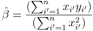

Chapter 3 Exercises - Conceptual
================

-   [Question 1](#question-1)
-   [Question 2 (in progress)](#question-2-in-progress)
-   [Question 3](#question-3)
-   [Question 4](#question-4)
-   [Question 5](#question-5)

Question 1
----------

*Describe the null hypotheses to which the p-values given in Table 3.4 correspond. Explain what conclusions you can draw based on these p-values. Your explanation should be phrased in terms of `sales`, `TV`, `radio`, and `newspaper`, rather than in terms of the coefficients of the linear model.*

We display **Table 3.4** below for ease of reference:

|           | Coefficient | Std. error | t-statistic | p-value     |
|-----------|-------------|------------|-------------|-------------|
| Intercept | 2.939       | 0.3119     | 9.42        | &lt; 0.0001 |
| TV        | 0.046       | 0.0014     | 32.81       | &lt; 0.0001 |
| radio     | 0.189       | 0.0086     | 21.89       | &lt; 0.0001 |
| newspaper | −0.001      | 0.0059     | −0.18       | 0.8599      |

Conclusions are derived at an alpha level of **.05**.

For `TV`:
Null hypothesis: For a given amount spent on `radio` and `newspaper`, there is **no** relationship between `sales` and `TV`.
Conclusion: We **reject** the null hypothesis, and infer that there is a relationship between `sales` and `TV` for a given amount spent on `radio` and `newspaper`.

For `radio`:
Null hypothesis: For a given amount spent on `TV` and `newspaper`, there is **no** relationship between `sales` and `radio`.
Conclusion: We **reject** the null hypothesis, and infer that there is a relationship between `sales` and `radio` for a given amount spent on `TV` and `newspaper`.

For `newspaper`:
Null hypothesis: For a given amount spent on `TV` and `radio`, there is **no** relationship between `sales` and `newspaper`.
Conclusion: We **do not reject** the null hypothesis, and infer that there is no relationship between `sales` and `newspaper` for a given amount spent on `TV` and `radio`.

Question 2 (in progress)
------------------------

*Carefully explain the differences between the KNN classifier and KNN regression methods.*

-   The KNN classifier is used for **classification** problems where the response variable is qualitative/categorical. The KNN regression method is used for **regression** problems where the response variable is quantitative.
-   The KNN classifier selects a response variable based on the **response class with the highest conditional probability** within N0. The KNN regression method evaluates a response variable based on the **average of the training responses** in N0.

Question 3
----------

*Suppose we have a data set with five predictors, X1 = GPA, X2 = IQ, X3 = Gender (1 for Female and 0 for Male), X4 = Interaction between GPA and IQ, and X5 = Interaction between GPA and Gender. The response is starting salary after graduation (in thousands of dollars). Suppose we use least squares to fit the model, and get ˆβ0 = 50, ˆβ1 = 20, ˆβ2 = 0.07, ˆβ3 = 35, ˆβ4 = 0.01, ˆβ5 = −10.*

### Part 3a

**Which answer is correct, and why?**
i. For a fixed value of IQ and GPA, males earn more on average than females.
ii. For a fixed value of IQ and GPA, females earn more on average than males.
iii. **For a fixed value of IQ and GPA, males earn more on average than females provided that the GPA is high enough.**
iv. For a fixed value of IQ and GPA, females earn more on average than males provided that the GPA is high enough.

<!-- $$ \text{Salary} = 50 + 20 \times \text{GPA} + 0.07 \times \text{IQ} + 35 \times \text{Gender} + 0.01 \times (\text{IQ}\times\text{GPA}) - 10\times(\text{Gender}\times\text{GPA}) $$ --> For a fixed value of IQ and GPA, the coefficient for Gender will be (35 - 10 × GPA), which means that it will become negative when the value of GPA is greater than 3.5. Since Gender is coded as 1 for Female, a negative coefficient at high GPA means that females will earn less than males (i.e. males will earn more than females) on average when the GPA is high enough.

### Part 3b

**Predict the salary of a female with IQ of 110 and a GPA of 4.0.**

<!-- $$ \hat{y} = 50 + 20(4.0) + 0.07(110) + 35(1) + 0.01(110 \times 4.0) - 10(1 \times 4.0) = 137.1 $$ --> The predicted salary would be **$137,100** since Y is expressed in thousands of dollars.

### Part 3c

**True or false: Since the coefficient for the GPA/IQ interaction term is very small, there is very little evidence of an interaction effect. Justify your answer.**

**False**. Whether an interaction effect is statistically significant is not dependent on the magnitude of the coefficient, but on **how far the coefficient is from 0 in terms of its standard error**. If the standard error of the coefficient is small, then we can infer that the interaction effect is present.

We can conduct a hypothesis test, with the null hypothesis that there is no relationship between the interaction effect and the response variable. We can divide the coefficient by its standard error to obtain a *t-statistic*, which yields a *p-value* based on the number of degrees of freedom. If the standard error is small enough, the t-statistic will be large and the p-value will be small enough for us to reject the null hypothesis.

Question 4
----------

**I collect a set of data (n = 100 observations) containing a single predictor and a quantitative response. I then fit a linear regression model to the data, as well as a separate cubic regression, i.e. Y = β0 + β1X + β2X2 + β3X3 + ϵ.**

<!-- $$ Y = \beta_0 + \beta_1X + \beta_2X^{2} + \beta_3X^{3} + \epsilon $$ -->
### Part 4a

*Suppose that the true relationship between X and Y is linear, i.e. Y = β0 + β1X + ϵ. Consider the training residual sum of squares (RSS) for the linear regression, and also the training RSS for the cubic regression. Would we expect one to be lower than the other, would we expect them to be the same, or is there not enough information to tell? Justify your answer.*

The cubic regression model may exhibit a lower training RSS than the linear model. Even if the true relationship between X and Y is linear, the data points may not fall close to a straight line due to the irreducible error ϵ. Thus, we expect the residuals, and thus the RSS, to be greater for the linear model than for the cubic model which is more flexible.

### Part 4b

*Answer (a) using test rather than training RSS.*

The linear regression model is expected to have lower test RSS. Since the true relationship between X and Y is linear, the linear model is still expected to be a good fit for the test data. On the other hand, the cubic regression model captures background patterns caused by the irreducible error ϵ in the training data, which are probably not present in the test data; the residuals generated for the test data are likely to be larger for the cubic model as a result.

### Part 4c

*Suppose that the true relationship between X and Y is not linear, but we don’t know how far it is from linear. Consider the training RSS for the linear regression, and also the training RSS for the cubic regression. Would we expect one to be lower than the other, would we expect them to be the same, or is there not enough information to tell? Justify your answer.*

The cubic regression model is expected to have the lower training RSS. Since the true relationship between X and Y is not linear, the linear model is not expected to fit the data well and instead generate high residuals and RSS for the training data. The cubic model is more flexible and should produce lower residuals and RSS.

### Part 4d

*Answer (c) using test rather than training RSS.*

There is not enough information to tell. If, for example, the relationship resembles the logistic function (an 'S' shaped curve), the cubic model might not fit the data as well as the linear model.

Question 5
----------

*Consider the fitted values that result from performing linear regression without an intercept. In this setting, the ith fitted value takes the form*

<!-- $$ \hat{y}_i = x_i \hat{\beta} $$ -->

*where*

 <!-- $$ \hat{\beta} = \frac{(\sum_{i'=1}^{n}x_{i'} y_{i'})}{(\sum_{i'=1}^{n}x_{i'}^2)} $$ -->

*Show that we can write*

 <!-- $$ \hat{y}_i = \sum_{i'=1}^{n} a_{i'}y_{i'} $$ -->

*What is ai'?*

Expand the numerator of the ̂β term, and multiply xi across the the individual terms. We can then rewrite the expression in terms of yi' and ai' as shown below:

<!-- \hat{y}_i = x_i \hat{\beta} = x_i\frac{(\sum_{i'=1}^{n}x_{i'} y_{i'})}{(\sum_{i'=1}^{n}x_{i'}^2)} -->

<!-- = y_1\frac{x_ix_1}{\sum_{i'=1}^{n}x_{i'}^2} + y_2\frac{x_ix_2}{\sum_{i'=1}^{n}x_{i'}^2} + \dots + y_n\frac{x_ix_n}{\sum_{i'=1}^{n}x_{i'}^2} -->

<!-- = \sum_{i'=1}^{n} a_{i'}y_{i'} \text{  , where  } a_{i'} = \frac{x_ix_{i'}}{\sum_{i'=1}^{n}x_{i'}^2} -->
