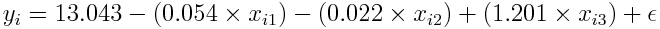

Chapter 3 Exercises - Question 10
================

-   [Question 10](#question-10)
    -   [Part 10a](#part-10a)
    -   [Part 10b](#part-10b)
    -   [Part 10c](#part-10c)
    -   [Part 10d](#part-10d)
    -   [Part 10e](#part-10e)
    -   [Part 10f](#part-10f)
    -   [Part 10g](#part-10g)
    -   [Part 10h](#part-10h)

Question 10
-----------

*This question should be answered using the `Carseats` data set.*

We load the `Carseats` data set and examine the structure:

``` r
data("Carseats")
str(Carseats)
```

    ## 'data.frame':    400 obs. of  11 variables:
    ##  $ Sales      : num  9.5 11.22 10.06 7.4 4.15 ...
    ##  $ CompPrice  : num  138 111 113 117 141 124 115 136 132 132 ...
    ##  $ Income     : num  73 48 35 100 64 113 105 81 110 113 ...
    ##  $ Advertising: num  11 16 10 4 3 13 0 15 0 0 ...
    ##  $ Population : num  276 260 269 466 340 501 45 425 108 131 ...
    ##  $ Price      : num  120 83 80 97 128 72 108 120 124 124 ...
    ##  $ ShelveLoc  : Factor w/ 3 levels "Bad","Good","Medium": 1 2 3 3 1 1 3 2 3 3 ...
    ##  $ Age        : num  42 65 59 55 38 78 71 67 76 76 ...
    ##  $ Education  : num  17 10 12 14 13 16 15 10 10 17 ...
    ##  $ Urban      : Factor w/ 2 levels "No","Yes": 2 2 2 2 2 1 2 2 1 1 ...
    ##  $ US         : Factor w/ 2 levels "No","Yes": 2 2 2 2 1 2 1 2 1 2 ...

We can see that our variables of interest can be classified as quantitative and categorical:

-   `Sales` - Unit sales (in thousands) at each location, quantitative response
-   `Price` - Price company charges for car seats at each site, quantitative predictor
-   `Urban` - A factor with levels No and Yes to indicate whether the store is in an urban or rural location (Yes = 2, No = 1), qualitative predictor
-   `US` - A factor with levels No and Yes to indicate whether the store is in the US or not (Yes = 2, No = 1), qualitative predictor

### Part 10a

*Fit a multiple regression model to predict `Sales` using `Price`, `Urban`, and `US`.*

``` r
carseats_multiple_lm <- lm(Sales ~ Price + Urban + US, data = Carseats)
summary(carseats_multiple_lm)
```

    ## 
    ## Call:
    ## lm(formula = Sales ~ Price + Urban + US, data = Carseats)
    ## 
    ## Residuals:
    ##     Min      1Q  Median      3Q     Max 
    ## -6.9206 -1.6220 -0.0564  1.5786  7.0581 
    ## 
    ## Coefficients:
    ##              Estimate Std. Error t value Pr(>|t|)    
    ## (Intercept) 13.043469   0.651012  20.036  < 2e-16 ***
    ## Price       -0.054459   0.005242 -10.389  < 2e-16 ***
    ## UrbanYes    -0.021916   0.271650  -0.081    0.936    
    ## USYes        1.200573   0.259042   4.635 4.86e-06 ***
    ## ---
    ## Signif. codes:  0 '***' 0.001 '**' 0.01 '*' 0.05 '.' 0.1 ' ' 1
    ## 
    ## Residual standard error: 2.472 on 396 degrees of freedom
    ## Multiple R-squared:  0.2393, Adjusted R-squared:  0.2335 
    ## F-statistic: 41.52 on 3 and 396 DF,  p-value: < 2.2e-16

The contrasts for the qualitative predictors `Urban` and `US` are as shown below:

``` r
contrasts(Carseats$Urban)
```

    ##     Yes
    ## No    0
    ## Yes   1

``` r
contrasts(Carseats$US)
```

    ##     Yes
    ## No    0
    ## Yes   1

### Part 10b

*Provide an interpretation of each coefficient in the model. Be careful—some of the variables in the model are qualitative!*

-   The coefficient for `Price` is -0.05446. This means that for every dollar the company charges for the car seats, the average unit sales **decreases** by about **54.46 units**.
-   The coefficient for `UrbanYes` is -0.02192. This means that on average, stores in urban locations sell **21.92 less units** than stores in rural locations.
-   The coefficient for `US` is 1.201. This means that on average, stores in the United States sell **1201 more units** than stores outside of the United States.

### Part 10c

*Write out the model in equation form, being careful to handle the qualitative variables properly.*

 <!-- $$ y_i = 13.043 - (0.054 \times x_{i1}) - (0.022 \times x_{i2}) + (1.201 \times x_{i3}) + \epsilon $$ -->

 <!-- $$ \text{where } x_{i2} =\begin{cases}1 & \text{if }i\text{th store is in an urban location}\\0 & \text{if }i\text{th store is in a rural location}\end{cases} $$ -->

 <!-- $$ \text{where } x_{i3} =\begin{cases}1 & \text{if }i\text{th store is in the US}\\0 & \text{if }i\text{th store is not in the US}\end{cases} $$ -->

### Part 10d

*For which of the predictors can you reject the null hypothesis H<sub>0</sub>: β<sub>j</sub> = 0?*

We can reject the null hypothesis for the predictors `Price` and `US`, based on the p-values for these two predictors being very low. In other words, we infer that there is a significant relationship between `Price` and `Sales`, as well as `US` and `Sales`.

### Part 10e

*On the basis of your response to the previous question, fit a smaller model that only uses the predictors for which there is evidence of association with the outcome.*

``` r
carseats_smaller_lm <- lm(Sales ~ Price + US, data = Carseats)
summary(carseats_smaller_lm)
```

    ## 
    ## Call:
    ## lm(formula = Sales ~ Price + US, data = Carseats)
    ## 
    ## Residuals:
    ##     Min      1Q  Median      3Q     Max 
    ## -6.9269 -1.6286 -0.0574  1.5766  7.0515 
    ## 
    ## Coefficients:
    ##             Estimate Std. Error t value Pr(>|t|)    
    ## (Intercept) 13.03079    0.63098  20.652  < 2e-16 ***
    ## Price       -0.05448    0.00523 -10.416  < 2e-16 ***
    ## USYes        1.19964    0.25846   4.641 4.71e-06 ***
    ## ---
    ## Signif. codes:  0 '***' 0.001 '**' 0.01 '*' 0.05 '.' 0.1 ' ' 1
    ## 
    ## Residual standard error: 2.469 on 397 degrees of freedom
    ## Multiple R-squared:  0.2393, Adjusted R-squared:  0.2354 
    ## F-statistic: 62.43 on 2 and 397 DF,  p-value: < 2.2e-16

### Part 10f

*How well do the models in (a) and (e) fit the data?*

    ##                            Model   RSE Rsquared
    ## 1 Model with Price, Urban and US 2.472   0.2393
    ## 2        Model with Price and US 2.469   0.2393

Both models exhibit similar levels of RSE (residual squared error), and explain about 24% of the variance in `sales`.

### Part 10g

*Using the model from (e), obtain 95% confidence intervals for the coefficient(s).*

``` r
confint(carseats_smaller_lm)
```

    ##                   2.5 %      97.5 %
    ## (Intercept) 11.79032020 14.27126531
    ## Price       -0.06475984 -0.04419543
    ## USYes        0.69151957  1.70776632

### Part 10h

*Is there evidence of outliers or high leverage observations in the model from (e)?*

``` r
par(mfrow = c(2,2))
plot(carseats_smaller_lm, id.n = 5)
```


From the residuals-fitted values plot, we see that there are some outliers (indices 51 and 377 show the greatest residuals), however most of these outliers do not have significant leverage.
From the residuals-leverage plot, there is one high-leverage observation but it does not have a residual that is large enough to exert significant influence on the model.
