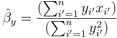

```{r setup, include=FALSE}
knitr::opts_chunk$set(echo = TRUE, warning = FALSE)
library(MASS)
library(ISLR)
library(dplyr)
```

## Question 11
*In this problem we will investigate the t-statistic for the null hypothesis H~0~ : β = 0 in simple linear regression without an intercept. To begin, we generate a predictor x and a response y as follows.*

```{r}
set.seed(1)
x <- rnorm(100)
y <- 2 * x + rnorm(100)
```

### Part 11a
*Perform a simple linear regression of y onto x , without an intercept. Report the coefficient estimate ˆβ, the standard error of this coefficient estimate, and the t-statistic and p-value associated with the null hypothesis H~0~: β = 0. Comment on these results. (You can perform regression without an intercept using the command `lm(y ~ x + 0)`.)*

```{r}
nointercept_yx_lm <- lm(y ~ x + 0)
summary(nointercept_yx_lm)$coefficients
```

The estimated coefficient ˆβ is very close to the true value of β (which is 2). The standard error for ˆβ is also very small relative to the estimated value, which creates a very large t-statistic and very small p-value.  
The likelihood of obtaining this estimate of β, assuming the null hypothesis is true, would be this p-value, and so we can infer that this is unlikely and thus reject the null hypothesis. Therefore we conclude that there is some relationship between X and Y.

### Part 11b
*Now perform a simple linear regression of x onto y without an intercept, and report the coefficient estimate, its standard error, and the corresponding t-statistic and p-values associated with the null hypothesis H~0~: β = 0. Comment on these results.*

```{r}
nointercept_xy_lm <- lm(x ~ y + 0)
summary(nointercept_xy_lm)$coefficients
```

The t-statistic and p-value are in fact the same as those obtained in (a). Based on the small p-value, we can also reject the null hypothesis that β = 0, and likewise conclude that there is some relationship between Y and X.

### Part 11c
*What is the relationship between the results obtained in (a) and (b)?*

The estimated coefficient obtained in (b) is approximately the reciprocal of the estimated coefficient in (a), because the linear model used in (b) is the inverse of the model in (a).

### Part 11d (in progress)
For the regression of Y onto X without an intercept, the t-statistic for H~0~: β = 0 takes the form ˆβ/SE(ˆβ), where ˆβ is given by (3.38), and where


<!-- $$ \text{SE}(\hat{\beta}) =  \sqrt{\frac{\sum_{i=1}^{n} (y_i - x_i\hat{\beta})^2}{(n-1)\sum_{i'=1}^{n} x_{i'}^2}} $$ -->

(These formulas are slightly different from those given in Sections 3.1.1 and 3.1.2, since here we are performing regression without an intercept.) Show algebraically, and confirm numerically in R , that the t-statistic can be written as

### Part 11e
*Using the results from (d), argue that the t-statistic for the regression of `y` onto `x` is the same as the t-statistic for the regression of `x` onto `y`.*

The above expression for the t-statistic would yield the same value if we replaced x~i~ with y~i~ and y~i~ with x~i~ (when we perform regression of `x` onto `y`). Therefore the t-statistic would be the same for both regression models.

### Part 11f
*In `R`, show that when regression is performed with an intercept, the t-statistic for H~0~: β~1~ = 0 is the same for the regression of `y` onto `x` as it is for the regression of `x` onto `y`.*

We generate a predictor `x1` and response `y1` as follows:

```{r}
set.seed(2)
x1 <- rnorm(100)
y1 <- 2 * x1 + 3 + # example intercept is 3
    rnorm(100) # error term
```

The regression of `y` onto `x` yields the following t-statistic:

```{r}
intercept_yx_lm <- lm(y1 ~ x1)
summary(intercept_yx_lm)$coefficients
```

The regression of `x` onto `y` yields the following t-statistic:

```{r}
intercept_xy_lm <- lm(x1 ~ y1)
summary(intercept_xy_lm)$coefficients
```

We can see from the above output that the t-statistic for β~1~ is the same for both regression models.

## Question 12
*This problem involves simple linear regression without an intercept.*

### Part 12a
*Recall that the coefficient estimate ˆβ for the linear regression of Y onto X without an intercept is given by (3.38). Under what circumstance is the coefficient estimate for the regression of X onto Y the same as the coefficient estimate for the regression of Y onto X?*

ˆβ for the linear regression of Y onto X is given by:


If we were to perform regression of X onto Y: the coefficient estimate ˆβ~y~ would be: 


<!-- \hat{\beta}_y = \frac{(\sum_{i'=1}^{n}y_{i'} x_{i'})}{(\sum_{i'=1}^{n}y_{i'}^2)} -->

The two coefficient estimates would be the the same if:

* the true linear coefficient is close to 1 (since one coefficient is the reciprocal of the other)
* the sum of squares for X and sum of squares for Y are the same


### Part 12b 
*Generate an example in `R` with n = 100 observations in which the coefficient estimate for the regression of X onto Y is different from the coefficient estimate for the regression of Y onto X.*

```{r 12b setup}
set.seed(12)
x_12b <- rnorm(100)
y_12b <- x_12b + rnorm(100, mean = 0, sd = 1)  # Y = X + e
coefficients(lm(y_12b ~ x_12b))
coefficients(lm(x_12b ~ y_12b))
```


### Part 12c (Needs review)
*Generate an example in `R` with n = 100 observations in which the coefficient estimate for the regression of X onto Y is the same as the coefficient estimate for the regression of Y onto X.*

```{r 12c setup}
# construct x and y off a common set of random values so that the linear coefficient is close to 1
set.seed(123)
base <- rnorm(100)

# x contains some random noise
x_12c <- base + rnorm(100, mean = 0, sd = 0.01)
# sum of squares for x
SSx_12c <- sum(x_12c^2) 

# construct first 99 values of y
y_12c <- base[1:99] + rnorm(99, mean = 0, sd = 0.01)
# 100th value of y is determined such that the sums of squares would be equal,
# and based on whether the corresponding x value is positive/negative
if(x_12c[100] < 0){
    last_y <- -(sqrt(SSx_12c - sum(y_12c^2)))
} else {
    last_y <- sqrt(SSx_12c - sum(y_12c^2))
}
y_12c <- append(y_12c, last_y)

coefficients(lm(y_12c ~ x_12c))
coefficients(lm(x_12c ~ y_12c))
```

